---
tags:
  - portfolio/kneos
  - moc
aliases:
  - KneOS
  - Portfolio
---

# KneOS Portfolio

> [!abstract] Qué es
> Portfolio personal presentado como un "sistema operativo" simulado (**KneOS**), proyectado con Three.js sobre la pantalla de una PC modelada en 3D. Es una app full-stack: backend Express/Prisma que persiste sesiones, íconos del escritorio, chats de IA, contenido de archivos y puntajes de un minijuego; frontend en JavaScript vanilla (sin framework ni bundler) que implementa ventanas, drag&drop, menús contextuales y apps al estilo escritorio.
>
> Código fuente: `C:\Users\canel\Downloads\Codigo\Portfolio\Portfolio`

Este es el mapa de contenido (MOC) de toda la documentación técnica del proyecto. `ARCHITECTURE.md` (en el repo) es un resumen rápido pero está **desactualizado** — no incluye la app Kfruit, el módulo txt, ni varios archivos `core/` nuevos. Esta documentación sí refleja el estado actual del código.

## Mapa

```mermaid
graph TD
    A[KneOS Portfolio] --> B[Arquitectura]
    A --> C[Backend]
    A --> D[Frontend Core]
    A --> E[Frontend Model, Services y Utils]
    A --> F[Apps de escritorio]
    A --> G[Escena 3D]
    A --> H[Deuda Técnica]

    C --> C1[Módulo Session]
    C --> C2[Módulo Icon]
    C --> C3[Módulo KneAI]
    C --> C4[Módulo Groq]
    C --> C5[Módulo Txt]
    C --> C6[Módulo Kfruit]

    D --> D1[DesktopManager]
    D --> D2[DesktopGrid y DesktopFolder]
    D --> D3[Menús Contextuales]
    D --> D4[Window y Taskbar]
    D --> D5[File]
    D --> D6[Clock]
    D --> D7[Drag and Drop y Selección Múltiple]

    F --> F1[TxtFile]
    F --> F2[Folder]
    F --> F3[KneAI]
    F --> F4[Doom]
    F --> F5[Kmd]
    F --> F6[Kfruit]
    F --> F7[Maxwell]

    class A internal-link;
    class B internal-link;
    class C internal-link;
    class D internal-link;
    class E internal-link;
    class F internal-link;
    class G internal-link;
    class H internal-link;
```

## Secciones

- [[Arquitectura]] — stack tecnológico, capas backend/frontend, modelo de "sesión" (`pc_id`)
- [[Backend]] — Express/Prisma/PostgreSQL, esquema de BD y los 6 dominios expuestos
- [[Frontend Core]] — infraestructura del escritorio simulado (ventanas, grid, menús, taskbar)
- [[Frontend Model Services Utils]] — datos estáticos, clientes HTTP y helpers
- [[Apps]] — las 7 apps de escritorio (TxtFile, Folder, KneAI, Doom, Kmd, Kfruit, Maxwell)
- [[Escena 3D]] — cómo se proyecta el iframe de KneOS sobre la pantalla de la PC 3D (Three.js)
- [[Deuda Técnica]] — bugs, inconsistencias y dependencias sin usar detectados en la exploración

## Stack en una línea

**Backend**: Express 5 (ESM) + Prisma 5 + PostgreSQL + proxy propio a Groq API (`llama-3.3-70b-versatile`).
**Frontend**: JS vanilla + ES Modules (sin bundler), Three.js, interact.js, js-dos, **planck** (física 2D del juego Kfruit).
